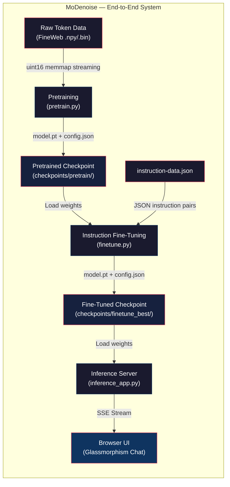
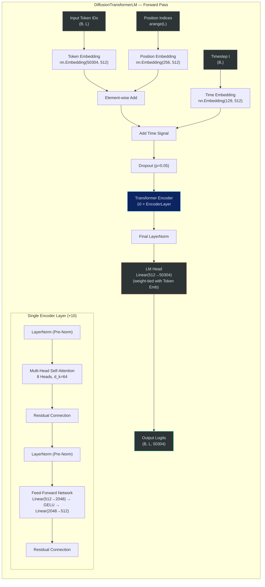
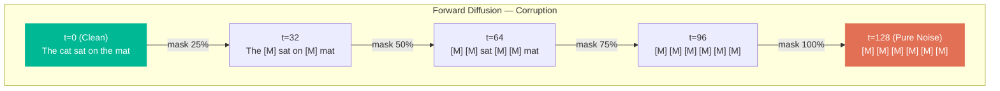
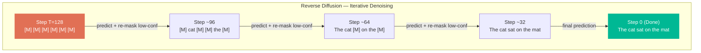
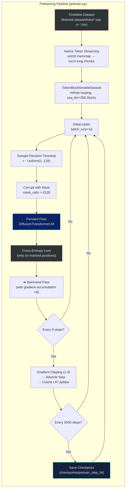
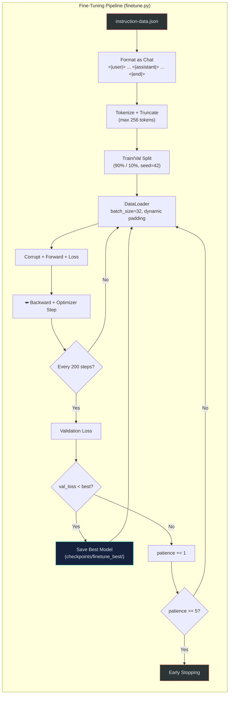
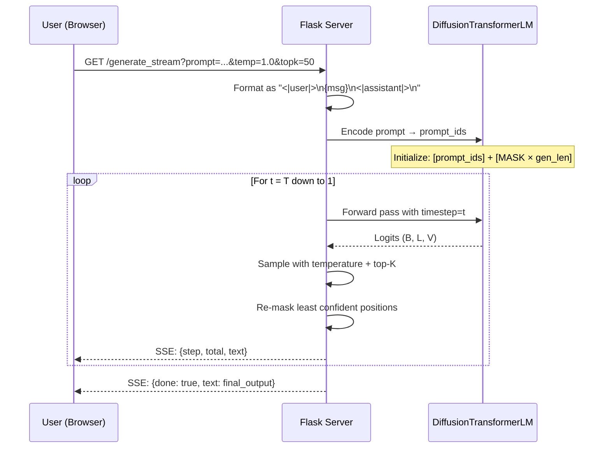
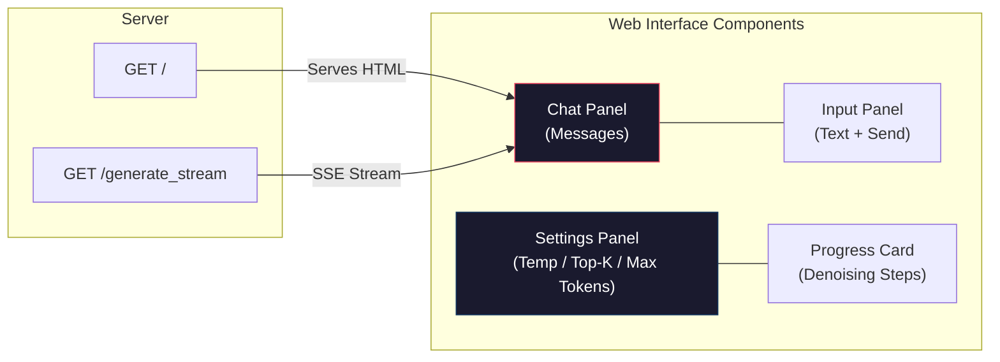

# MoDenoise — Masked Diffusion Transformer Language Model

> A from-scratch implementation of an **Absorbing-State Discrete Diffusion Language Model** in PyTorch. 
> Instead of autoregressive left-to-right generation, MoDenoise treats text generation as an **iterative denoising process** — unmasking tokens in parallel from pure noise to coherent language.

---

## Table of Contents

- [Overview](#overview)
- [High-Level Architecture](#high-level-architecture)
- [Model Architecture Deep Dive](#model-architecture-deep-dive)
 - [Transformer Encoder Block](#transformer-encoder-block)
 - [Embedding Strategy](#embedding-strategy)
 - [Weight Tying](#weight-tying)
- [Model Parameters & Hyperparameters](#model-parameters--hyperparameters)
- [Diffusion Process](#diffusion-process)
 - [Forward Process (Corruption)](#forward-process-corruption)
 - [Reverse Process (Denoising / Generation)](#reverse-process-denoising--generation)
- [Training Pipeline](#training-pipeline)
 - [Phase 1 — Pretraining](#phase-1--pretraining)
 - [Phase 2 — Instruction Fine-Tuning](#phase-2--instruction-fine-tuning)
- [Inference & Web Interface](#inference--web-interface)
- [Project Structure](#project-structure)
- [Environment Setup](#environment-setup)
- [Usage Guide](#usage-guide)
- [Tokenizer Details](#tokenizer-details)
- [License](#license)

---

## Overview

Traditional large language models (GPT, LLaMA, etc.) generate text **autoregressively** — one token at a time, left to right. MoDenoise takes a fundamentally different approach inspired by diffusion models from image generation:

1. **Start with noise** — an entirely `[MASK]`-ed sequence.
2. **Iteratively denoise** — at each diffusion step, predict all masked tokens in parallel, then re-mask the least confident predictions.
3. **Converge to coherent text** — after `T` steps, the sequence resolves from noise into fluent language.

This enables **parallel token generation**, **bidirectional context awareness**, and a unique **"watch the text emerge from noise"** user experience.

---

## High-Level Architecture



---

## Model Architecture Deep Dive

### Transformer Encoder Block

The core model is a **pure Transformer Encoder** (not a decoder). It uses **bidirectional self-attention** — every token can attend to every other token in the sequence. This is critical for diffusion: the model needs full context to predict masked positions scattered anywhere in the sequence.



### Embedding Strategy

The model combines **three separate learned embeddings** that are summed element-wise:

| Embedding | Shape | Purpose |
|-----------|-------|---------|
| **Token Embedding** | `(50304, 512)` | Maps each vocabulary token to a dense vector |
| **Position Embedding** | `(256, 512)` | Injects absolute positional information (learned, not sinusoidal) |
| **Time Embedding** | `(129, 512)` | Encodes the current diffusion timestep `t ∈ [0, 128]`, telling the model its current noise level |

### Weight Tying

The **LM head** (output projection) shares its weight matrix with the **token embedding** layer. This is a standard technique that:
- Reduces total parameter count by ~25M parameters
- Ensures the output logit space is aligned with the input embedding space
- Acts as an implicit regularizer

---

## Model Parameters & Hyperparameters

### Architecture Parameters

| Parameter | Value | Description |
|-----------|-------|-------------|
| **Total Parameters** | **~57.5M** | Trainable parameters |
| **Architecture Type** | Transformer Encoder | Bidirectional self-attention (not causal/decoder) |
| **Vocabulary Size** | 50,304 | GPT-2 base (50,257) + 6 special tokens, padded to multiple of 64 |
| **Max Sequence Length** | 256 | Maximum tokens per input sequence |
| **Hidden Dimension (d_model)** | 512 | Dimensionality of all internal representations |
| **Feed-Forward Dimension (d_ff)** | 2,048 | 4× expansion ratio in FFN blocks |
| **Encoder Layers** | 10 | Depth of the transformer stack |
| **Attention Heads** | 8 | Parallel attention heads per layer |
| **Head Dimension (d_k)** | 64 | d_model / n_heads |
| **Diffusion Steps (T)** | 128 | Total discrete timesteps in the diffusion process |
| **Activation Function** | GELU | Gaussian Error Linear Unit |
| **Normalization** | Pre-Norm LayerNorm | LayerNorm applied before attention/FFN (norm-first) |
| **Weight Tying** | Yes | LM head shares weights with token embedding |

### Pretraining Hyperparameters

| Hyperparameter | Value | Description |
|----------------|-------|-------------|
| **Training Steps** | 30,000 | Total optimizer steps (~4 hour target) |
| **Batch Size** | 16 | Per-device micro-batch size |
| **Gradient Accumulation** | 8 | Effective batch = 16 × 8 = 128 |
| **Learning Rate** | 5e-4 | Peak learning rate |
| **Weight Decay** | 0.1 | AdamW L2 regularization |
| **Warmup Steps** | 2,000 | Linear warmup before cosine decay |
| **LR Schedule** | Cosine Annealing | With linear warmup |
| **Optimizer** | AdamW | Decoupled weight decay |
| **Gradient Clipping** | 1.0 | Max gradient norm |
| **Mixed Precision** | bf16 / fp16 | Auto-selected based on GPU support |
| **Dropout** | 0.05 | Applied after embedding sum |
| **Checkpoint Interval** | 5,000 steps | Saves intermediate checkpoints |
| **Validation Interval** | 500 steps | Evaluates on 10 validation batches |

### Fine-Tuning Hyperparameters

| Hyperparameter | Value | Description |
|----------------|-------|-------------|
| **Training Steps** | 3,000 | Total optimizer steps |
| **Batch Size** | 32 | Per-device micro-batch size |
| **Gradient Accumulation** | 1 | Effective batch = 32 |
| **Learning Rate** | 5e-5 | 10× lower than pretraining |
| **Weight Decay** | 0.01 | Lighter regularization |
| **Warmup Steps** | 100 | Shorter warmup |
| **Dropout** | 0.1 | Higher dropout to prevent overfitting |
| **Validation Split** | 10% | Held-out for early stopping |
| **Early Stopping Patience** | 5 | Stop after 5 non-improving evaluations |
| **Eval Interval** | 200 steps | More frequent evaluation |
| **Best Model Saving** | Yes | Saves best model by validation loss |

### Inference Hyperparameters (User-Controllable)

| Hyperparameter | Default | Range | Description |
|----------------|---------|-------|-------------|
| **Temperature** | 1.0 | 0.1 – 2.0 | Controls sampling randomness |
| **Top-K** | 50 | 0 – 200 | Limits sampling to top-K most likely tokens |
| **Max New Tokens** | 128 | 32 – 256 | Maximum generated response length |

---

## Diffusion Process

### Forward Process (Corruption)

During training, the forward diffusion process **corrupts** clean text by randomly replacing tokens with `[MASK]`:



**Masking schedule**: Linear — at timestep `t`, the mask ratio is `t / T`. Special tokens (`BOS`, `EOS`, `PAD`) are **never masked**.

**Training objective**: Cross-entropy loss computed **only on masked positions** (clean tokens are ignored with `label = -100`).

### Reverse Process (Denoising / Generation)

During inference, the model starts from a fully masked sequence and **iteratively denoises**:



**Re-masking strategy**: At each step, the model predicts all masked tokens, then **re-masks the least confident predictions** based on the confidence schedule. The number of positions to keep masked decreases as `t → 0`.

---

## Training Pipeline

### Phase 1 — Pretraining



**Key design decisions**:
- **No text decoding at data-load time**: Raw uint16 token IDs are memory-mapped directly from disk, bypassing the tokenizer encoding bottleneck entirely.
- **Infinite iterator**: The dataset loops infinitely — training is purely step-count based, not epoch based.
- **HuggingFace Accelerate**: Handles device placement, mixed-precision casting, and distributed training automatically.

### Phase 2 — Instruction Fine-Tuning



**Key differences from pretraining**:
- **Lower learning rate** (5e-5 vs 5e-4) to avoid catastrophic forgetting
- **Higher dropout** (0.1 vs 0.05) to regularize on the smaller instruction dataset
- **Early stopping** with patience=5 to prevent overfitting
- **Best-model checkpointing** — only the best validation loss model is saved

---

## Inference & Web Interface

### Inference Pipeline



### Web Interface Architecture

The inference app serves a **monolithic single-page application** with:

- **Backend**: Flask server with SSE (Server-Sent Events) streaming endpoint
- **Frontend**: Glassmorphism-styled chat interface with monochrome theme
- **Real-time controls**: Live sliders for Temperature, Top-K, and Max Tokens
- **Denoising visualization**: Users watch masked `█` blocks progressively resolve into text
- **Progress tracking**: Visual progress bar showing denoising step count



---

## Project Structure

```
difffusion llm/
├── pretrain.py # Phase 1: Pretraining on raw token data
├── finetune.py # Phase 2: Instruction fine-tuning with early stopping
├── inference_app.py # Flask web server + chat UI + SSE streaming
├── setup.bat # One-click environment setup (Windows)
├── instruction-data.json # Instruction dataset for fine-tuning
├── README.md # This file
├── .gitignore # Git ignore rules
│
├── tokenizer_pretrain/ # Saved GPT-2 tokenizer with special tokens
│ ├── tokenizer.json
│ ├── tokenizer_config.json
│ ├── vocab.json
│ ├── merges.txt
│ ├── added_tokens.json
│ └── special_tokens_map.json
│
├── checkpoints/ # All model checkpoints (git-ignored)
│ ├── pretrain/ # Final pretrained model
│ │ ├── model.pt # ~230 MB state_dict
│ │ ├── config.json # DiffusionLMConfig as JSON
│ │ └── tokenizer/ # Saved tokenizer copy
│ ├── pretrain_step_5000/ # Intermediate checkpoints
│ ├── pretrain_step_10000/
│ ├── ...
│ ├── finetune/ # Final fine-tuned model
│ └── finetune_best/ # Best fine-tuned model (by val loss)
│
└── fineweb dataset/ # Raw pretraining data (git-ignored)
 ├── train/ # .npy or .bin memmap token files
 └── val/ # Validation split
```

---

## Environment Setup

### Prerequisites

- Python 3.9+
- NVIDIA GPU with 6GB+ VRAM (CUDA support required)
- PyTorch 2.0+ with CUDA

### Quick Setup (Windows)

```bash
setup.bat
```

### Manual Setup

```bash
pip install torch transformers accelerate tokenizers tiktoken tqdm numpy flask
```

### Verify GPU

```bash
python -c "import torch; print(f'CUDA: {torch.cuda.is_available()}, GPU: {torch.cuda.get_device_name(0)}, BF16: {torch.cuda.is_bf16_supported()}')"
```

---

## Usage Guide

### 1. Prepare Dataset

Download the FineWeb memmap token dataset:
- Source: [FineWeb Memmap Tokens on Kaggle](https://www.kaggle.com/datasets/abdulwahidrukua/fineweb-memmap-tokens)
- Extract `.npy` or `.bin` files into `fineweb dataset/train/`

### 2. Pretrain

```bash
python pretrain.py
```

**Options:**
| Flag | Description |
|------|-------------|
| `--smoke-test` | Run 10 steps for quick validation |
| `--data-dir <path>` | Path to dataset directory (default: `fineweb dataset`) |
| `--resume` | Resume from last checkpoint |
| `--steps <N>` | Override total training steps (default: 30,000) |

### 3. Fine-Tune

```bash
python finetune.py
```

**Options:**
| Flag | Description |
|------|-------------|
| `--smoke-test` | Run 10 steps for quick validation |

### 4. Run Inference

```bash
python inference_app.py
```

Open `http://localhost:5000` in your browser. The app automatically loads the best fine-tuned checkpoint, falling back to the pretrained checkpoint if fine-tuning hasn't been run.

---

## Tokenizer Details

| Property | Value |
|----------|-------|
| **Base Tokenizer** | GPT-2 (HuggingFace `GPT2TokenizerFast`) |
| **Base Vocabulary** | 50,257 tokens |
| **Added Special Tokens** | `[PAD]`, `[MASK]`, `<\|user\|>`, `<\|assistant\|>`, `<\|system\|>`, `<\|end\|>` |
| **Final Vocabulary** | 50,304 (padded to multiple of 64 for GPU efficiency) |
| **Encoding** | BPE (Byte-Pair Encoding) |

### Special Token Roles

| Token | Role |
|-------|------|
| `[MASK]` | Diffusion mask token — replaces tokens during corruption |
| `[PAD]` | Padding for variable-length sequences |
| `<\|user\|>` | Marks start of user instruction in chat format |
| `<\|assistant\|>` | Marks start of model response in chat format |
| `<\|system\|>` | System prompt delimiter (reserved) |
| `<\|end\|>` | End of conversation turn |

---

## License

This project is licensed under the [Apache License 2.0](LICENSE). See the [LICENSE](LICENSE) file for details.
